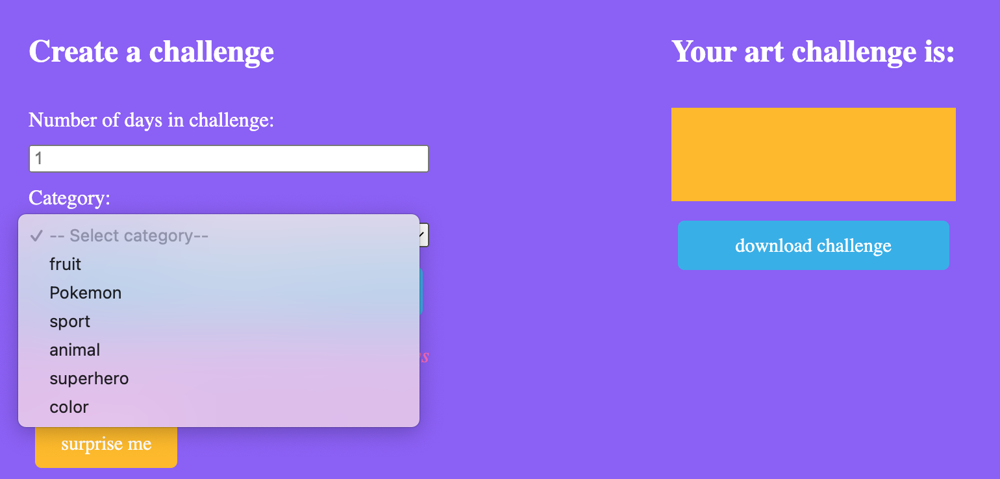

# Art Challenge Generator
An art challenge is a commitment an artist makes to complete some sort of
series of work over a set amount of time. It can be a great way to improve skills,
build portfolio, and/or to get over art block.

## Feature Set
### Challenge Generator
User can generate specified amount of words from curated categories or surprise themselves with a random amount and assortment of words.<br>


### User Submissions
Registered users can share challenges for others to complete or add words to categories for challenge generator.<br>


### Inspiration Corner
Random art piece (every time page is refreshed) and quote (however frequently Inspiration API updates) to inspire and motivate users.<br>


## Dependencies
Art Challenge Generator relies on:
- Google Firebase
    - Authentication
    - Storage
- APIs
    - [Proxy server](https://github.com/anacapamu/art-challenge-generator-proxy-server) to protect API keys
        - [Wordnik](https://developer.wordnik.com/docs)
        - [Rijksmuseum](https://data.rijksmuseum.nl/object-metadata/api/#access-to-apis)
    - [Categorized Words API](https://github.com/anacapamu/categorized-words) for user and admin to create their own categories and words
    - [Inspiration](https://api.goprogram.ai/inspiration/docs/)

## Set Up
1. Create a Firebase project
2. Fork or clone [Categorized Words API](https://github.com/anacapamu/categorized-words) and deploy it
3. Fork or clone [proxy server](https://github.com/anacapamu/art-challenge-generator-proxy-server), add API keys, and deploy it
4. Fork or clone this repository and create a `.env` file
    ```bash
    # .env

    # Firebase Configurations
    REACT_APP_FIREBASE_API_KEY="replace_with_key"
    REACT_APP_FIREBASE_AUTH_DOMAIN="replace_with_domain"
    REACT_APP_FIREBASE_PROJECT_ID="replace_with_id"
    REACT_APP_FIREBASE_STORAGE_BUCKET="replace_with_url"
    REACT_APP_FIREBASE_MESSAGING_SENDER_ID="replace_with_id"
    REACT_APP_FIREBASE_APP_ID="replace_with_id"
    REACT_APP_FIREBASE_MEASUREMENT_ID="replace_with_id"

    # Categorized Words API URL
    REACT_APP_BACKEND_URL="replace_with_url"

    # Proxy Server URL
    REACT_APP_PROXY_SERVER="replace_with_url"
    ```
